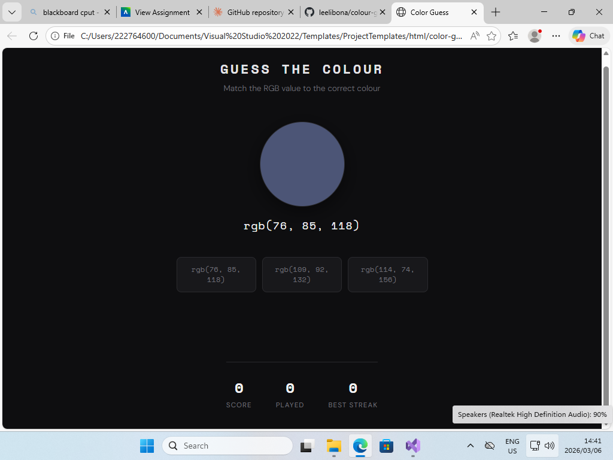
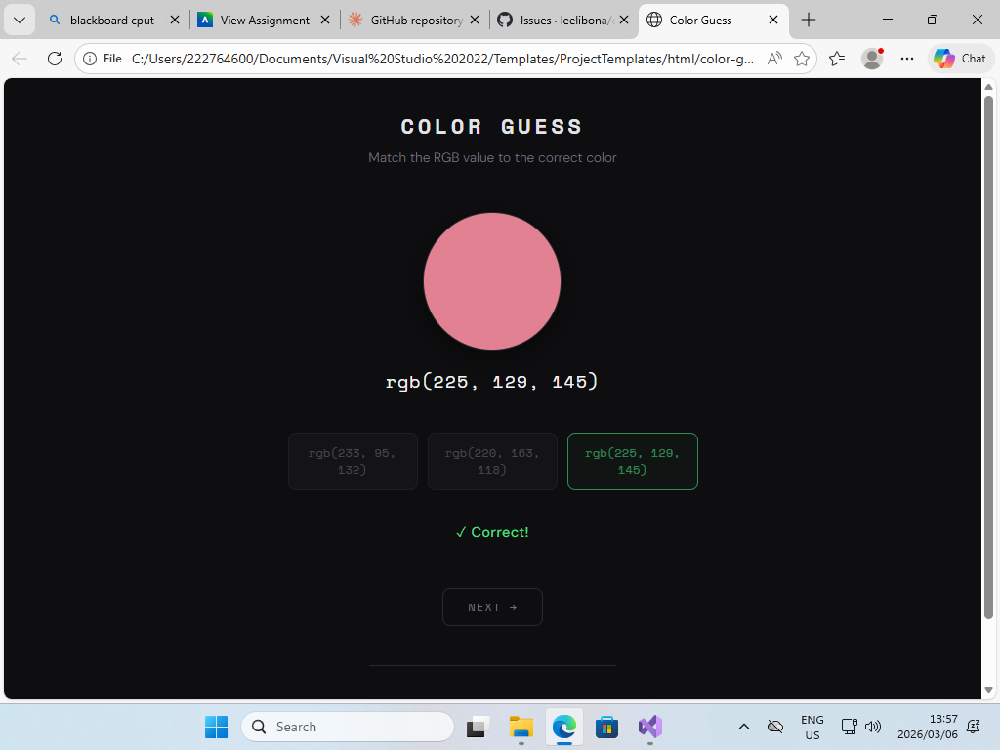
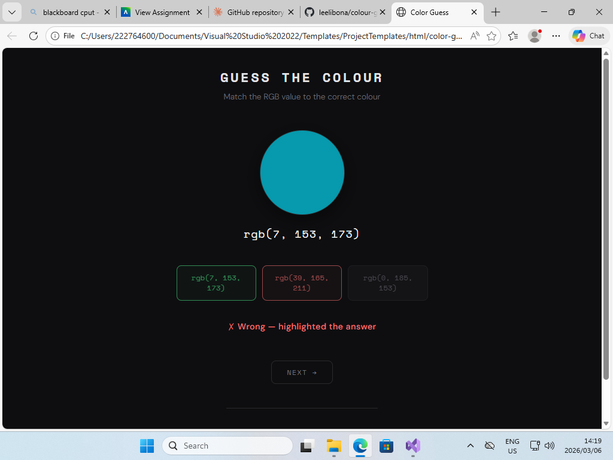

# 🌈 Color Guess Game

A simple and fun browser-based game where you match RGB color values to the correct color swatch. Built with plain HTML, CSS, and JavaScript — no frameworks or installs required.

---

## 📋 Description

**Color Guess** is a JavaScript game that tests your ability to identify colors from their RGB values. Each round displays a colored circle and its `rgb(r, g, b)` code. Your job is to pick the matching color from three options. The game tracks your score, total rounds played, and best streak.

This project was built as part of the Postgraduate Diploma in Software Engineering — demonstrating version control, clean code structure, and JavaScript fundamentals.

---

## 🎮 How to Play

1. A color circle and its RGB value are displayed on screen
2. Three color options are shown as buttons
3. Click the button that matches the displayed RGB value
4. ✅ Correct = green highlight + score goes up
5. ❌ Wrong = red highlight + correct answer is revealed
6. Click **NEXT →** to move to the next round
7. Build a streak of 3+ correct answers to trigger 🔥

---

## 🚀 How to Run

No installation or server needed. This is a single-file HTML application.

**Option 1 — Direct browser open:**
1. Download or clone this repository
2. Locate the `color-game.html` file
3. Double-click it — it opens in your default browser instantly

**Option 2 — VS Code with Live Server:**
1. Open the project folder in VS Code
2. Install the **Live Server** extension
3. Right-click `color-game.html` → **Open with Live Server**

---

## 🛠️ Prerequisites & Dependencies

| Requirement | Detail |
|-------------|--------|
| Browser | Any modern browser (Chrome, Firefox, Edge, Safari) |
| Internet | Only needed to load Google Fonts (game works offline too) |
| Runtime | None — pure HTML/CSS/JS, no Node.js or npm required |

---

## 📁 Project Structure

```
color-game/
│
├── color-game.html     # Main game file (all-in-one HTML, CSS & JS)
├── README.md           # Project documentation
└── screenshots/        # Game screenshots
    ├── start-screen.png
    ├── correct-guess.png
    └── wrong-guess.png
```

---

## 📸 Screenshots

> All screenshots taken on local machine with system timestamp visible.

### Game Start Screen


### Correct Guess


### Wrong Guess


---

## ✨ Features

- 🎨 Random RGB color generation each round
- 🧠 Deliberately "nearby" wrong answers — not too easy!
- 📊 Live score, rounds played & best streak tracking
- 🔥 Streak indicator (activates at 3+ correct in a row)
- ✅ Correct answer always revealed after each guess
- 📱 Responsive design — works on desktop and mobile
- 🌙 Clean dark theme with monospace typography

---

## 🧰 Technologies Used

- **HTML5** — Page structure
- **CSS3** — Styling, layout (Flexbox/Grid), animations
- **JavaScript (Vanilla)** — Game logic, DOM manipulation
- **Google Fonts** — Space Mono & DM Sans typefaces

---

## 👤 Author

**Liso Mantakana**  
Postgraduate Diploma in Software Engineering  
GitHub: [github.com/LisoMantakana/color-game](https://github.com/LisoMantakana/color-game)

---

## 📄 License

This project is submitted for academic purposes as part of a Software Engineering assignment.
